# 🧹 Lógica de Generación y Reparto de Tareas

## 📋 Descripción General

El sistema de generación de tareas está diseñado para asignar automáticamente las tareas de limpieza a las empleadas disponibles, considerando múltiples factores como horarios, vacaciones, prioridades y tiempo disponible.

## 🎯 Objetivos del Sistema

1. **Optimización de recursos**: Asignar tareas de manera eficiente según la disponibilidad
2. **Consideración de vacaciones**: Adaptar la carga de trabajo cuando hay empleadas ausentes
3. **Priorización inteligente**: Asignar primero las tareas más importantes
4. **Flexibilidad**: Permitir edición manual de las tareas generadas
5. **Trazabilidad**: Logs detallados para debugging y seguimiento

## 🏗️ Arquitectura del Sistema

### Componentes Principales

```
GeneracionTurnosService
├── generarTurnosInteligentes()     # Método principal
├── obtenerEmpleadasDisponibles()   # Filtra empleadas activas
├── obtenerEmpleadasEnVacaciones()  # Detecta ausencias
├── generarTurnosFinDeSemana()      # Lógica para sábados/domingos
├── generarTurnosEntreSemana()      # Lógica para lunes-viernes
├── asignarTareasPorPrioridad()     # Asigna tareas por prioridad
├── asignarTareasApartamentos()     # Tareas de apartamentos
├── asignarTareasZonasComunes()     # Tareas de zonas comunes
└── asignarTareasLavanderia()       # Tareas de lavandería
```

## 📅 Lógica por Tipo de Día

### 1. FINES DE SEMANA (Sábado y Domingo)

#### Características:
- **Una sola empleada** trabaja
- **7 horas** de trabajo asignadas
- **Todas las tareas** de limpieza se asignan

#### Proceso:
```php
1. Seleccionar la primera empleada disponible
2. Crear turno de 7 horas (08:00 - 15:00)
3. Asignar TODAS las tareas de apartamentos
4. Asignar TODAS las tareas de zonas comunes
5. Si hay tiempo restante, asignar lavandería
```

#### Código:
```php
private function generarTurnosFinDeSemana($fecha, $empleadasActivas)
{
    $empleadaPrincipal = $empleadasActivas->first();
    $turno = $this->crearTurno($empleadaPrincipal, $fecha, '08:00', '15:00');
    $tareasAsignadas = $this->asignarTodasLasTareasLimpieza($turno, 7.0);
}
```

### 2. ENTRE SEMANA (Lunes a Viernes)

#### Características:
- **Múltiples empleadas** pueden trabajar
- **Horas variables** según contratación
- **Lógica adaptativa** según vacaciones

#### Proceso:
```php
1. Verificar si hay empleadas en vacaciones
2. Para cada empleada disponible:
   - Calcular horas a asignar según lógica de vacaciones
   - Crear turno con horas calculadas
   - Asignar tareas por prioridad
3. Aplicar lógica de vacaciones:
   - Con vacaciones: 8h → 7h, 6h → 4h
   - Sin vacaciones: horas normales contratadas
```

#### Código:
```php
private function generarTurnosEntreSemana($fecha, $empleadasActivas, $empleadasEnVacaciones)
{
    $hayVacaciones = $empleadasEnVacaciones->isNotEmpty();
    
    foreach ($empleadasActivas as $empleada) {
        $horasAsignar = $this->calcularHorasAsignar($empleada->horas_contratadas_dia, $hayVacaciones);
        $turno = $this->crearTurno($empleada, $fecha, $horaInicio, $horaFin);
        $tareasAsignadas = $this->asignarTareasPorPrioridad($turno, $horasAsignar, $hayVacaciones);
    }
}
```

## 🎯 Sistema de Prioridades

### Jerarquía de Tareas

| Prioridad | Tipo de Tarea | Descripción | Tiempo Estimado |
|-----------|---------------|-------------|-----------------|
| **10** | Limpieza Apartamentos (con vacaciones) | Máxima prioridad cuando hay ausencias | Variable por apartamento |
| **9** | Limpieza Apartamentos (normal) | Limpieza estándar de apartamentos | Variable por apartamento |
| **8** | Limpieza Zonas Comunes | Áreas compartidas del edificio | Variable por zona |
| **7** | Limpieza Zonas Comunes (secundaria) | Zonas comunes adicionales | Variable por zona |
| **5** | Lavandería | Solo Edificio Costa y cocina | Variable según tipo |

### Algoritmo de Asignación

```php
1. PRIORIDAD 1: Apartamentos
   - Si hay vacaciones: prioridad 10
   - Si no hay vacaciones: prioridad 8
   - Ordenar por prioridad_limpieza (desc) + titulo (asc)

2. PRIORIDAD 2: Zonas Comunes
   - Prioridad 7
   - Ordenar por prioridad_limpieza (desc)

3. PRIORIDAD 3: Lavandería
   - Prioridad 5
   - Solo Edificio Costa y cocina
   - Si hay tiempo restante
```

## ⏰ Gestión de Tiempo

### Cálculo de Horas Disponibles

#### Fines de Semana:
```php
$horasDisponibles = 7.0; // Fijo para fin de semana
```

#### Entre Semana (Sin Vacaciones):
```php
$horasDisponibles = $empleada->horas_contratadas_dia; // 6h o 8h
```

#### Entre Semana (Con Vacaciones):
```php
if ($horasContratadas >= 8) {
    $horasDisponibles = 7.0; // Empleada de 8h → 7h
} else {
    $horasDisponibles = 4.0; // Empleada de 6h → 4h
}
```

### Validación de Tiempo

```php
// Verificar que no se exceda el tiempo disponible
if ($tiempoTotalAsignado > $tiempoDisponible) {
    Log::warning("⚠️ ADVERTENCIA: Tiempo asignado excede tiempo disponible");
}

// Parar asignación cuando no hay tiempo suficiente
if ($tiempoUsado + $tipoTarea->tiempo_estimado_minutos <= $tiempoDisponible) {
    // Asignar tarea
} else {
    break; // No hay más tiempo disponible
}
```

## 🏠 Tipos de Tareas Asignadas

### 1. Limpieza de Apartamentos

#### Criterios de Selección:
- Apartamentos activos (`activo = true`)
- Ordenados por `prioridad_limpieza` (descendente)
- Luego por `titulo` (ascendente)

#### Proceso:
```php
$apartamentos = Apartamento::where('activo', true)
    ->orderBy('prioridad_limpieza', 'desc')
    ->orderBy('titulo', 'asc')
    ->get();

foreach ($apartamentos as $apartamento) {
    if ($tiempoUsado + $tipoTarea->tiempo_estimado_minutos <= $tiempoDisponible) {
        // Crear tarea de limpieza
    }
}
```

### 2. Limpieza de Zonas Comunes

#### Criterios de Selección:
- Zonas comunes activas (`activo = true`)
- Ordenadas por `prioridad_limpieza` (descendente)

#### Proceso:
```php
$zonasComunes = ZonaComun::where('activo', true)
    ->orderBy('prioridad_limpieza', 'desc')
    ->get();
```

### 3. Lavandería

#### Criterios de Selección:
- Solo Edificio Costa
- Solo si hay tiempo restante
- Prioridad más baja

#### Proceso:
```php
$edificioCosta = Edificio::where('nombre', 'like', '%Costa%')->first();
if ($edificioCosta && $tiempoRestante > 0) {
    // Asignar tarea de lavandería
}
```

## 🔍 Sistema de Logging

### Niveles de Log

#### INFO (Información General):
```php
Log::info("🚀 Generando turnos inteligentes para {$fecha}");
Log::info("👥 Empleadas disponibles: {$empleadasActivas->count()}");
Log::info("✅ Total tareas asignadas: " . count($tareasAsignadas));
```

#### WARNING (Advertencias):
```php
Log::warning("⚠️ No hay empleadas disponibles para {$fecha}");
Log::warning("⚠️ ADVERTENCIA: Tiempo asignado excede tiempo disponible");
```

#### ERROR (Errores):
```php
Log::error("❌ Error creando tarea para apartamento {$apartamento->id}: " . $e->getMessage());
```

#### DEBUG (Detalles):
```php
Log::debug("✅ Tarea creada para apartamento {$apartamento->titulo} (orden: {$tarea->orden_ejecucion})");
```

## 🛠️ Gestión Manual de Tareas

### Funcionalidades Disponibles

#### 1. Edición de Tareas:
- Cambiar tipo de tarea
- Modificar apartamento/zona común
- Ajustar prioridad (1-10)
- Cambiar orden de ejecución
- Añadir observaciones

#### 2. Estados de Tareas:
- **Pendiente**: Tarea asignada, no iniciada
- **En Progreso**: Tarea iniciada, en ejecución
- **Completada**: Tarea finalizada

#### 3. Operaciones CRUD:
- **Crear**: Añadir nueva tarea al turno
- **Leer**: Ver detalles de la tarea
- **Actualizar**: Modificar tarea existente
- **Eliminar**: Quitar tarea del turno

### Interfaz de Usuario

#### Tabla de Tareas:
```html
<table class="table table-striped">
    <thead>
        <tr>
            <th>#</th>           <!-- Orden de ejecución -->
            <th>Estado</th>      <!-- Checkbox para completar -->
            <th>Tarea</th>       <!-- Nombre del tipo de tarea -->
            <th>Elemento</th>    <!-- Apartamento/Zona común -->
            <th>Tiempo Est.</th> <!-- Tiempo estimado -->
            <th>Tiempo Real</th> <!-- Tiempo real empleado -->
            <th>Prioridad</th>   <!-- Prioridad calculada -->
            <th>Acciones</th>    <!-- Editar, Ver, Eliminar -->
        </tr>
    </thead>
</table>
```

#### Modal de Edición:
```html
<div class="modal fade" id="addTaskModal">
    <form id="taskForm">
        <input type="hidden" name="turno_id" value="{{ $turno->id }}">
        
        <!-- Tipo de tarea -->
        <select name="tipo_tarea_id" required>
            <option value="">Seleccionar tipo de tarea</option>
            @foreach($tiposTareas as $tipo)
                <option value="{{ $tipo->id }}">{{ $tipo->nombre }}</option>
            @endforeach
        </select>
        
        <!-- Apartamento -->
        <select name="apartamento_id">
            <option value="">Seleccionar apartamento</option>
            @foreach($apartamentos as $apartamento)
                <option value="{{ $apartamento->id }}">{{ $apartamento->titulo }}</option>
            @endforeach
        </select>
        
        <!-- Zona común -->
        <select name="zona_comun_id">
            <option value="">Seleccionar zona común</option>
            @foreach($zonasComunes as $zona)
                <option value="{{ $zona->id }}">{{ $zona->nombre }}</option>
            @endforeach
        </select>
        
        <!-- Prioridad -->
        <input type="number" name="prioridad_calculada" min="1" max="10" value="5">
        
        <!-- Observaciones -->
        <textarea name="observaciones" rows="3"></textarea>
    </form>
</div>
```

## 📊 Ejemplo de Flujo Completo

### Escenario: Lunes con una empleada en vacaciones

#### 1. Entrada:
```php
$fecha = '2024-01-15'; // Lunes
$empleadasDisponibles = 2; // María (8h), Ana (6h)
$empleadasEnVacaciones = 1; // Carmen (8h) en vacaciones
```

#### 2. Proceso:
```php
// Detectar que es entre semana
$esFinDeSemana = false;

// Detectar que hay vacaciones
$hayVacaciones = true;

// Calcular horas para cada empleada
$mariaHoras = 7.0; // 8h contratadas → 7h (hay vacaciones)
$anaHoras = 4.0;   // 6h contratadas → 4h (hay vacaciones)
```

#### 3. Asignación de Tareas:

##### María (7 horas):
```
Orden | Tarea | Elemento | Prioridad | Tiempo
------|-------|----------|-----------|--------
1     | Limpieza Apartamento | Apto 101 | 10 | 60min
2     | Limpieza Apartamento | Apto 102 | 10 | 60min
3     | Limpieza Apartamento | Apto 103 | 10 | 60min
4     | Limpieza Apartamento | Apto 201 | 10 | 60min
5     | Limpieza Apartamento | Apto 202 | 10 | 60min
6     | Limpieza Zona Común | Recepción | 7 | 45min
7     | Limpieza Zona Común | Pasillos | 7 | 30min
8     | Lavandería | Edificio Costa | 5 | 45min
```

##### Ana (4 horas):
```
Orden | Tarea | Elemento | Prioridad | Tiempo
------|-------|----------|-----------|--------
1     | Limpieza Apartamento | Apto 301 | 10 | 60min
2     | Limpieza Apartamento | Apto 302 | 10 | 60min
3     | Limpieza Apartamento | Apto 401 | 10 | 60min
4     | Limpieza Zona Común | Terraza | 7 | 60min
```

#### 4. Resultado:
- **Total tareas asignadas**: 12
- **Tiempo total**: 11 horas (7h + 4h)
- **Cobertura**: Todos los apartamentos + zonas comunes principales
- **Eficiencia**: Máxima prioridad a apartamentos por ausencia de Carmen

## 🔧 Configuración y Personalización

### Variables Configurables

#### En el Servicio:
```php
// Horas fijas para fin de semana
const HORAS_FIN_SEMANA = 7.0;

// Reducción de horas con vacaciones
const REDUCCION_8H = 1.0; // 8h → 7h
const REDUCCION_6H = 2.0; // 6h → 4h

// Prioridades por tipo de tarea
const PRIORIDAD_APARTAMENTOS_VACACIONES = 10;
const PRIORIDAD_APARTAMENTOS_NORMAL = 8;
const PRIORIDAD_ZONAS_COMUNES = 7;
const PRIORIDAD_LAVANDERIA = 5;
```

#### En la Base de Datos:
```sql
-- Apartamentos con prioridad de limpieza
ALTER TABLE apartamentos ADD COLUMN prioridad_limpieza INT DEFAULT 5;

-- Zonas comunes con prioridad de limpieza
ALTER TABLE zona_comuns ADD COLUMN prioridad_limpieza INT DEFAULT 5;

-- Tipos de tareas con tiempo estimado
ALTER TABLE tipos_tareas ADD COLUMN tiempo_estimado_minutos INT DEFAULT 60;
```

## 🚀 Mejoras Futuras

### Funcionalidades Planificadas

1. **Aprendizaje Automático**:
   - Analizar tiempos reales vs estimados
   - Ajustar estimaciones automáticamente
   - Optimizar rutas de limpieza

2. **Especialización por Empleada**:
   - Asignar tareas según habilidades
   - Preferencias personales
   - Historial de rendimiento

3. **Integración con Calendario**:
   - Considerar eventos especiales
   - Reservas de apartamentos
   - Mantenimientos programados

4. **Análisis Predictivo**:
   - Predecir carga de trabajo
   - Optimizar horarios
   - Detectar patrones de ausencias

## 📊 Diagrama de Flujo

### Flujo Principal de Generación de Tareas

```mermaid
flowchart TD
    A[Inicio: Generar Turnos] --> B{¿Es fin de semana?}
    
    B -->|Sí| C[Lógica Fin de Semana]
    B -->|No| D[Lógica Entre Semana]
    
    C --> C1[Seleccionar 1 empleada]
    C1 --> C2[Crear turno 7h]
    C2 --> C3[Asignar TODAS las tareas]
    C3 --> C4[Prioridad: Apartamentos → Zonas → Lavandería]
    
    D --> D1[Obtener empleadas disponibles]
    D1 --> D2{¿Hay vacaciones?}
    
    D2 -->|Sí| D3[Calcular horas reducidas]
    D2 -->|No| D4[Usar horas contratadas]
    
    D3 --> D5[8h → 7h, 6h → 4h]
    D4 --> D6[Horas normales]
    
    D5 --> D7[Para cada empleada]
    D6 --> D7
    
    D7 --> D8[Crear turno con horas calculadas]
    D8 --> D9[Asignar tareas por prioridad]
    
    C4 --> E[Asignar Apartamentos]
    D9 --> E
    
    E --> E1[Prioridad 10/8]
    E1 --> E2[Ordenar por prioridad_limpieza]
    E2 --> E3[Asignar hasta agotar tiempo]
    
    E3 --> F[Asignar Zonas Comunes]
    F --> F1[Prioridad 7]
    F1 --> F2[Ordenar por prioridad_limpieza]
    F2 --> F3[Asignar tiempo restante]
    
    F3 --> G[Asignar Lavandería]
    G --> G1[Prioridad 5]
    G1 --> G2[Solo Edificio Costa]
    G2 --> G3[Si hay tiempo restante]
    
    G3 --> H[Validar tiempo total]
    H --> I{¿Tiempo excedido?}
    
    I -->|Sí| J[Log Warning]
    I -->|No| K[Log Success]
    
    J --> L[Crear tareas en BD]
    K --> L
    
    L --> M[Retornar resultado]
```



### Sistema de Prioridades

```mermaid
graph TD
    A[Sistema de Prioridades] --> B[Prioridad 10: Apartamentos con Vacaciones]
    A --> C[Prioridad 9: Apartamentos Normales]
    A --> D[Prioridad 8: Apartamentos Secundarios]
    A --> E[Prioridad 7: Zonas Comunes]
    A --> F[Prioridad 5: Lavandería]
    
    B --> B1[Limpieza Apartamento]
    C --> C1[Limpieza Apartamento]
    D --> D1[Limpieza Apartamento]
    E --> E1[Limpieza Zona Común]
    F --> F1[Lavandería Edificio Costa]
    
    B1 --> G[Orden: prioridad_limpieza DESC + titulo ASC]
    C1 --> G
    D1 --> G
    E1 --> H[Orden: prioridad_limpieza DESC]
    F1 --> I[Si hay tiempo restante]
```



### Gestión de Tiempo

```mermaid
flowchart LR
    A[Entrada: Fecha] --> B{Tipo de Día}
    
    B -->|Fin de Semana| C[7 horas fijas]
    B -->|Entre Semana| D{¿Hay vacaciones?}
    
    D -->|No| E[Horas contratadas]
    D -->|Sí| F[Horas reducidas]
    
    E --> E1[8h → 8h]
    E --> E2[6h → 6h]
    
    F --> F1[8h → 7h]
    F --> F2[6h → 4h]
    
    C --> G[Asignar tareas]
    E1 --> G
    E2 --> G
    F1 --> G
    F2 --> G
    
    G --> H[Validar tiempo total]
    H --> I[Crear tareas]
```



## 📝 Conclusión

El sistema de generación de tareas está diseñado para ser:

- **Inteligente**: Considera múltiples factores para optimizar la asignación
- **Flexible**: Permite edición manual cuando sea necesario
- **Eficiente**: Maximiza el uso del tiempo disponible
- **Trazable**: Logs detallados para debugging y mejora continua
- **Escalable**: Fácil añadir nuevos tipos de tareas o criterios

La lógica está bien estructurada y documentada, facilitando el mantenimiento y la evolución del sistema.
